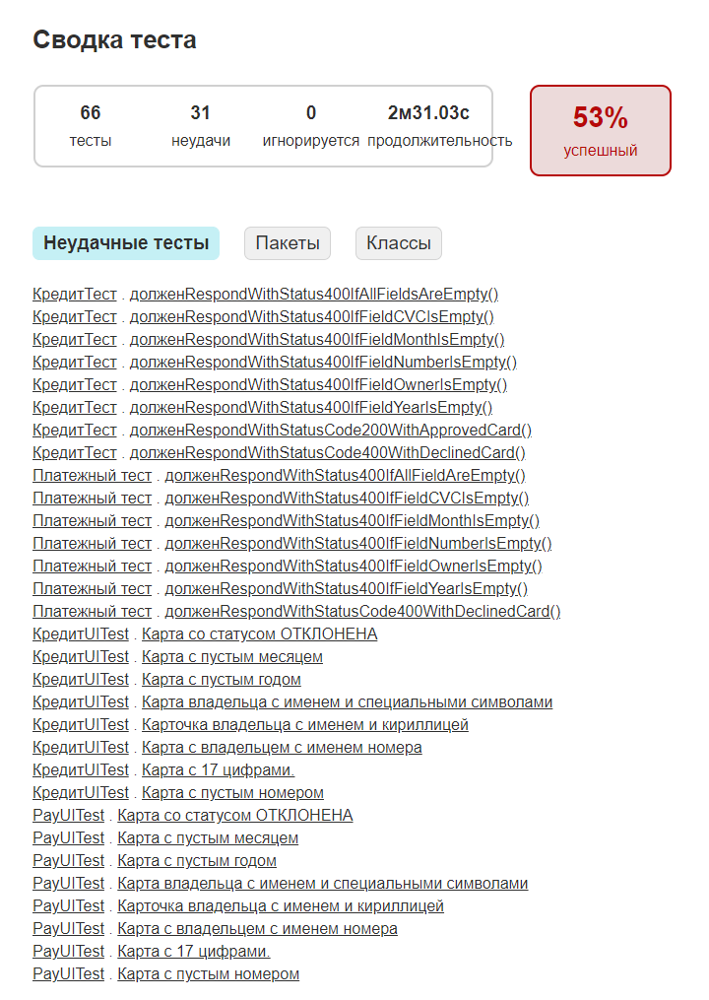
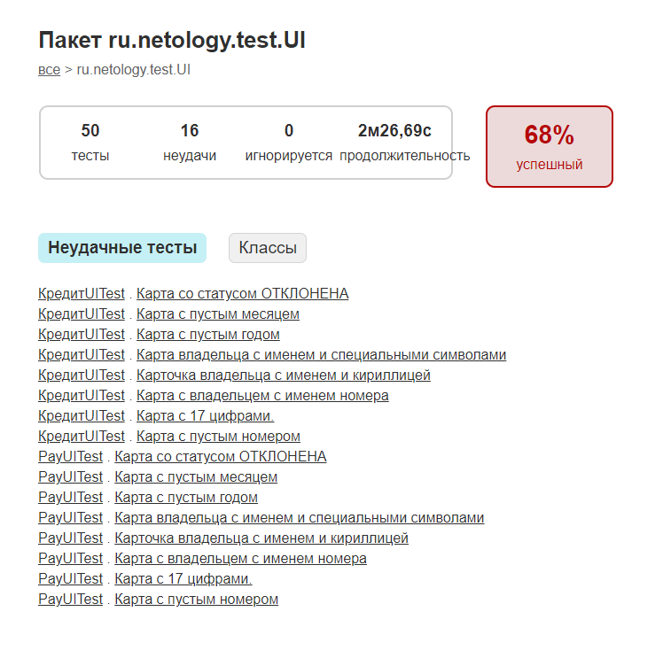
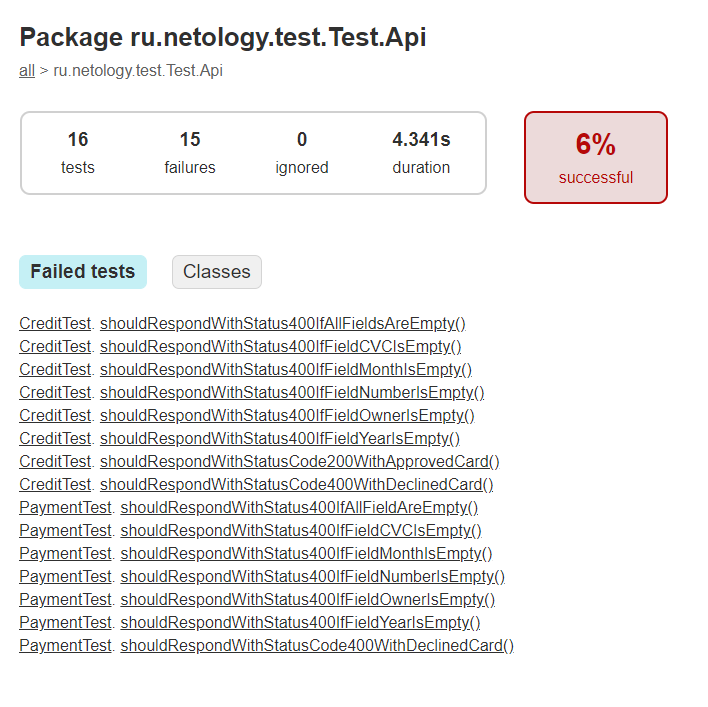

# Отчет о проведенном тестировании.
## Автоматизация тестирования комплексного сервиса для покупки тура, взаимодействующего с СУБД и API Банка.

**Покупка осуществляется при помощи:**
- Оплаты по дебетовой карте.
- Уникальной технологии: выдачи кредита по данным банковской карты.

## Тестовое окружение:
- Операционная система: Windows 11 Pro
- Java: OpenJDK version 11.0.21
- IDE: IntelliJ IDEA Community Edition 2023.3
- Docker Desktop: version 4.26.0
- Google Chrome: Версия 120.0.6099.71 (Официальная сборка), (64 бит)

## Результаты:
**Проведено 66 тестов, из них 35 успешных (53%):**
- тестирование UI – 50 тестов, из них 34 Passed, 16 Failed.
- тестирование API – 16 тестов, из них 1 Passed, 15 Failed.

